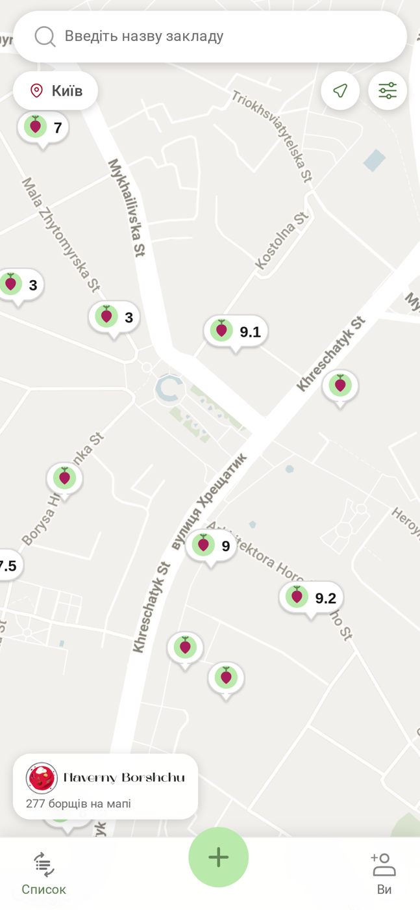
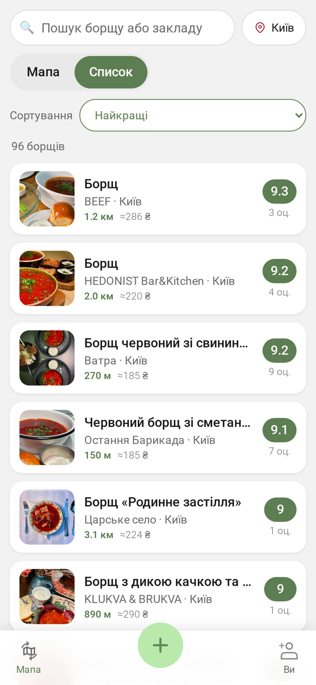

<div align="center">


# Naverny Borshchu — the borsch map

**A community map of Ukrainian borsch.** Find the borsch near you, rate it on
six separate criteria, and leave a mark — no five-star mush, no "how was our
service?".

[**map.navernyborshchu.com**](https://map.navernyborshchu.com) ·
[about the project](https://navernyborshchu.com) ·
[Українською](README.md)




</div>

---

## What this is

A live application, not a demo. As of 2026-09-12 it holds **277 borsches across
281 venues in 32 Ukrainian cities**, and the dataset grows with every review.

Borsch in Ukraine is not one dish, it is a thousand different ones. A star
rating cannot carry that: "4.5 stars" does not tell you whether it will be
thick, whether there is meat in it, or whether it is over-salted. So a rating
here is six separate questions (plus an overall impression):

| Criterion | Question | Scale |
|---|---|---|
| Meat | How much meat was in it? | not a single piece → in every spoonful |
| Beetroot | What colour was it? | barely pink → deep burgundy |
| Density | How thick is it? | like broth → the spoon stands up |
| Salt | How is the salt? | bland → over-salted |
| Aftertaste | What is the aftertaste? | unpleasant → wow! |
| Serving | How was it served? | sloppy → restaurant grade |

Note the salt scale: it is **not monotonic**. A 10 on salt is not "excellent",
it is "over-salted", so the best answer sits in the middle. The mascot and the
praise line are driven by the answer rather than by the number — otherwise the
app would cheer for a ruined borsch.

### Borsch scouting

The map distinguishes three states, each worth a different amount of XP:

- **`virgin`** — nobody has tasted this borsch yet. A "?" pin, ×3 XP for the
  first person to rate it, who becomes its **Pershovar** ("first-cook") and
  stays named on the borsch page forever.
- **`unverified`** — a rating exists from the founders' catalogue, but the
  community has not confirmed it. Dashed outline, ×2 XP.
- **`confirmed`** — a confirmed borsch with a Pershovar.

## Layout

```
map/
├── frontend/        React 19 (CRA) + SCSS modules + Google Maps JS API
├── backend/         Django 4.2 + DRF + SimpleJWT + PostgreSQL
├── deploy/          reference configuration of the production host
├── docs/            architecture, local development, deploy, API
└── .github/         CI/CD, issue and PR templates
```

| | Frontend | Backend |
|---|---|---|
| Stack | React 19, react-router 7, `@react-google-maps/api`, SCSS modules | Django 4.2, DRF, SimpleJWT, PostgreSQL, WhiteNoise |
| Auth | Google Sign-In (`@react-oauth/google`) | Google ID token verification → own JWTs |
| Tests | `react-scripts test` (Jest + Testing Library), 119 tests | `pytest` on SQLite, 55 tests |
| Production | [map.navernyborshchu.com](https://map.navernyborshchu.com) | [api.navernyborshchu.com](https://api.navernyborshchu.com) |

More in [docs/architecture.md](docs/architecture.md).

## Quick start

You need **Node 22+**, **Python 3.12+**, **PostgreSQL 14+** (SQLite is enough
for the tests) and a **Google Maps JavaScript API key** — without it the map
will not render.

```bash
git clone https://github.com/Naverny-Borshchu/map.git
cd map

# backend
cd backend
python3 -m venv venv && source venv/bin/activate
pip install -r requirements.txt
cp .env.example .env          # fill in DB_* and DJANGO_SECRET_KEY
python manage.py migrate
python manage.py runserver 8000

# frontend (in another terminal)
cd ../frontend
cp .env.example .env.local    # put your REACT_APP_API_KEY_MAP in
npm ci
npm start                     # http://localhost:3000
```

Full instructions, including running against the live API without a local
database, are in [docs/local-development.md](docs/local-development.md).

### Tests

```bash
cd backend  && DJANGO_SETTINGS_MODULE=naverny_borschu_api.settings_test pytest
cd frontend && CI=true npx react-scripts test --watchAll=false
```

Both suites must be green before a PR. CI checks anyway, and the frontend build
runs with `CI=true`, where a warning is an error.

## Contributing

The most useful thing you can do for this project is **rate a borsch** on
[map.navernyborshchu.com](https://map.navernyborshchu.com). The data matters
more than the code.

If you would rather write code, [CONTRIBUTING.md](CONTRIBUTING.md) covers
branches, commit style and what a PR needs. Issues labelled `good first issue`
are the best way in.

Ukrainian is the working language of the project, but pull requests and issues
in English are welcome.

## Licence

[MIT](LICENSE) for the code.

The map data (venues, prices, ratings) belongs to the project's community and
is not covered by that licence; there is no public dump yet. Maps and geocoding
come from the Google Maps Platform, under its terms.
