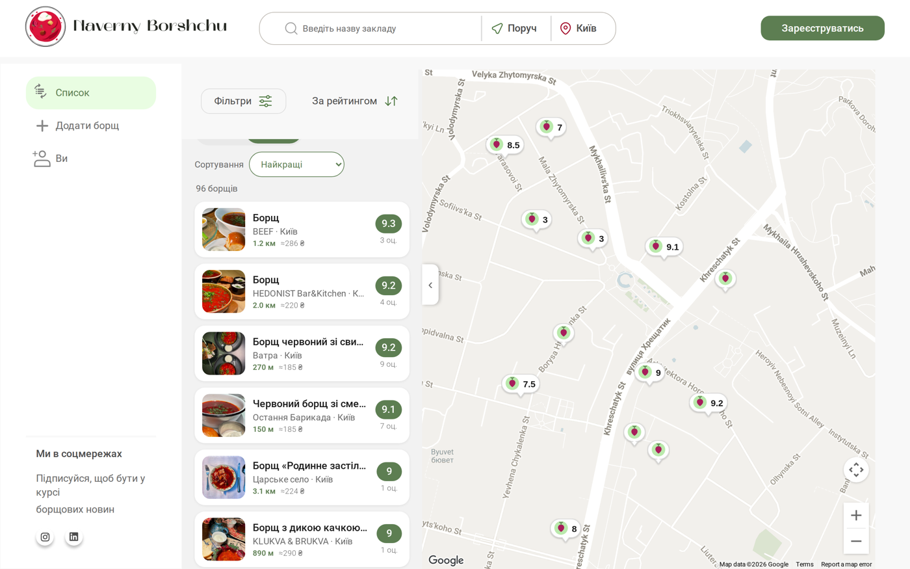

<div align="center">


# Наверни Борщу — мапа борщу

**Народна мапа борщу України.** Знайти борщ поруч, оцінити його за шістьма
критеріями й лишити слід — без застілля з десяти зірочок і без «оцініть наш
сервіс».

[](https://github.com/Naverny-Borshchu/map/actions/workflows/frontend.yml)
[](https://github.com/Naverny-Borshchu/map/actions/workflows/backend.yml)
[](LICENSE)

[**map.navernyborshchu.com**](https://map.navernyborshchu.com) ·
[про проєкт](https://navernyborshchu.com) ·
[English](README.en.md)


</div>

---

## Що це

Живий застосунок, не демо. Станом на 12.09.2026 на мапі **277 борщів у 281
закладі з 32 міст України** — і дані ростуть з кожного відгуку.

Борщ в Україні — не одна страва, а тисяча різних. Зіркові рейтинги цього не
ловлять: «4.5 зірки» не каже, чи буде він густий, чи багато там мʼяса і чи не
пересолений. Тому тут оцінка — це шість окремих питань (плюс загальне враження):

| Критерій | Питання | Шкала |
|---|---|---|
| Мʼясо | Скільки в ньому було мʼяса? | жодного шматочка → у кожній ложці |
| Буряк | Який був колір? | ледь рожевий → глибокий бордо |
| Густота | Наскільки густий? | як юшка → ложка стоїть |
| Сіль | Як там із сіллю? | прісний → пересолений |
| Післясмак | Який післясмак? | несмачно → вау! |
| Подача | Як подали? | неохайно → ресторанний стиль |

Зверніть увагу на сіль: її шкала **не монотонна**. 10 із солі — це не
«чудово», це «пересолено», тож найкраща відповідь посередині. Маскот і похвала
беруться з відповіді, а не з числа — інакше застосунок хвалив би за пересіл.

### Розвідка борщу

Мапа розрізняє три стани закладу, і за кожен дається різна кількість XP:

- **`virgin`** — борщ, який ще ніхто не куштував. Пін «?», ×3 XP тому, хто
  оцінить першим. Такий користувач стає **Першоваром** цього борщу, і його імʼя
  назавжди лишається на сторінці.
- **`unverified`** — є оцінка з каталогу засновників, але спільнота її ще не
  підтвердила. Пунктирна обводка, ×2 XP.
- **`confirmed`** — підтверджений борщ із Першоваром.

## Як це влаштовано

```
map/
├── frontend/        React 19 (CRA) + SCSS-модулі + Google Maps JS API
├── backend/         Django 4.2 + DRF + SimpleJWT + PostgreSQL
├── deploy/          довідкові конфіги бойового середовища
├── docs/            архітектура, локальна розробка, деплой, API
└── .github/         CI/CD, шаблони задач і PR
```

| | Фронтенд | Бекенд |
|---|---|---|
| Стек | React 19, react-router 7, `@react-google-maps/api`, SCSS-модулі | Django 4.2, DRF, SimpleJWT, PostgreSQL, WhiteNoise |
| Вхід | Google Sign-In (`@react-oauth/google`) | верифікація Google ID token → власні JWT |
| Тести | `react-scripts test` (Jest + Testing Library), 119 тестів | `pytest` на SQLite, 55 тестів |
| Прод | [map.navernyborshchu.com](https://map.navernyborshchu.com) | [api.navernyborshchu.com](https://api.navernyborshchu.com) |

Детальніше — [docs/architecture.md](docs/architecture.md).

## Швидкий старт

Потрібні: **Node 22+**, **Python 3.12+**, **PostgreSQL 14+** (для тестів
достатньо SQLite) і **ключ Google Maps JavaScript API** — без нього мапа не
відрендериться.

```bash
git clone https://github.com/Naverny-Borshchu/map.git
cd map

# бекенд
cd backend
python3 -m venv venv && source venv/bin/activate
pip install -r requirements.txt
cp .env.example .env          # заповніть DB_* і DJANGO_SECRET_KEY
python manage.py migrate
python manage.py runserver 8000

# фронтенд (в іншому терміналі)
cd ../frontend
cp .env.example .env.local    # впишіть REACT_APP_API_KEY_MAP
npm ci
npm start                     # http://localhost:3000
```

Повна інструкція, включно з роботою проти бойового API без піднімання бази, —
[docs/local-development.md](docs/local-development.md).

### Тести

```bash
cd backend  && DJANGO_SETTINGS_MODULE=naverny_borschu_api.settings_test pytest
cd frontend && CI=true npx react-scripts test --watchAll=false
```

Обидва набори мають бути зеленими до PR — CI все одно перевірить, а фронтендний
білд іде з `CI=true`, де ворнінг це помилка.

## Як долучитися

Найкорисніше, що можна зробити для проєкту, — **оцінити борщ** на
[map.navernyborshchu.com](https://map.navernyborshchu.com). Дані тут важливіші
за код.

Якщо хочеться коду — [CONTRIBUTING.md](CONTRIBUTING.md) описує гілки, стиль
комітів і вимоги до PR. Задачі з міткою `good first issue` — найкращий вхід.

## Ліцензія

[MIT](LICENSE) на код.

Дані мапи (заклади, ціни, оцінки) — власність спільноти проєкту й у цю ліцензію
не входять; окремого публічного дампу поки немає. Мапи й geocoding — Google
Maps Platform, на її умовах.

<div align="center"></div>
